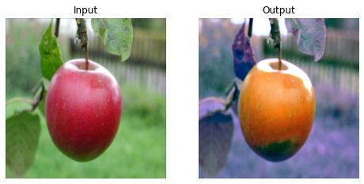
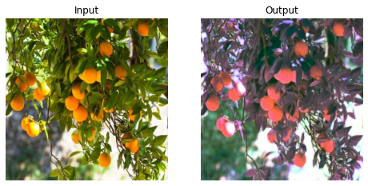
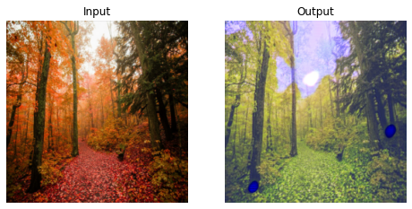
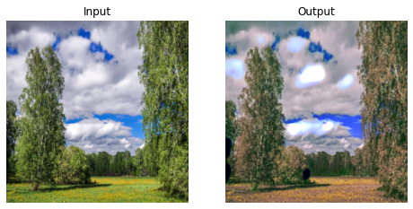

# CycleGAN
Финальный проект в рамках курса 
Deep Learning School по Computer Vision.

## Задача
На основе статьи [Unpaired Image-to-Image Translation using Cycle-Consistent Adversarial Networks](https://arxiv.org/abs/1703.10593) построить и обучить GAN, который переводит изображения домена A в изображения домена B.

## Данные
Модель обучена под два датасета:
- [Apple2Orange](https://www.kaggle.com/datasets/balraj98/apple2orange-dataset) : данный датасет взят с Kaggle
- [Autumn2Summer](https://drive.google.com/file/d/10nu9JK_ZPoFffBs02wXFzTrZmDZ0NKuL/view?usp=sharing): данный датасет составлен самостоятельно с помощью Яндекс Картинок по запросам "Осенний Лес" и "Летний лес"

## Результаты

### Apple2Orange
  

### Apple2Orange
  
